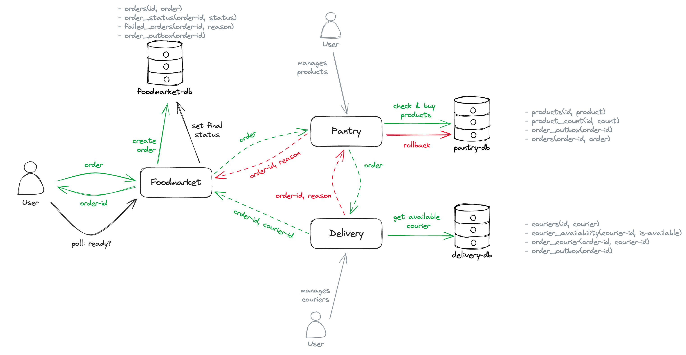

### Вводные

Выбрал паттерн Saga

Система: доставка продуктов. Есть 3 сервиса: 
- `pantry` — склад с продуктами, хранит все товары, а также их количество
- `delivery` — курьерская служба, хранит всех курьеров и поддерживает тех, кто сейчас свободен и может взять новый заказ
- `foodmarket` — точка входа клиента в систему, позволяет оформлять заказы и отслеживать их статус в дальнейшем

Заказ (order) состоит из набора продуктов. Чтобы заказ прошел успешно, нужно, чтобы:
- каждый из указанных продуктов был доступен на складе (то есть получен ок от `pantry`)
- хотя бы один курьер был готов взять заказ (получен ок от `delivery`)

Схематично:



### Запуск

```shell
docker compose up
sbt foodmarket/run
sbt pantry/run
sbt delivery/run
```

### Демонстрация

Тестовые данные для заполнения табличек положил в [test-data.sql](test-data.sql) (их нужно заполнить до старта сервисов)

В тестовых данных сразу заполнена таблица `foodmarket-db/order_outbox`, так что при старте автоматически запустатся 3 сценария:
- заказ успешно создан в системе, продукты собраны, курьер выехал
- на складе нет нужного количества продуктов
- все курьеры заняты

Также сделал запись экрана, где я пробежался по тестовым сценариям + сделал ещё пару заказов через api: https://disk.yandex.ru/i/MvUx-Q6W-xePAw
